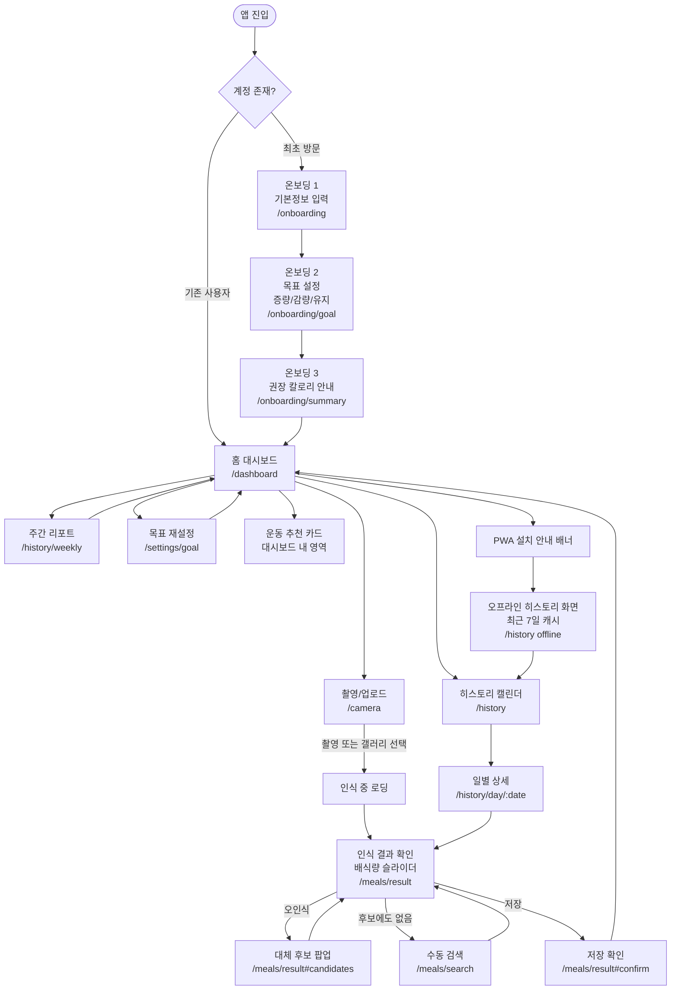
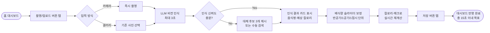
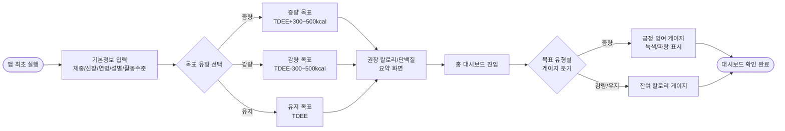

# 정보구조도 (Information Architecture)

> Week 3 산출물 (Document Chain #8). 기능명세서.md(#6)의 F-001~F-006 "관련 화면" 항목을 기반으로 작성됨.

**프로젝트명**: CaloMate (사진 한 장으로 끝내는 15초 칼로리 트래커)
**작성일**: 2026-09-06
**버전**: v1.0
**상태**: 승인 완료 (Approved)

---

## 1. 전체 사이트맵

> 온보딩(#F-003) → 홈 대시보드(#F-003, F-004) → 촬영/업로드(#F-001) → 인식결과/배식량보정(#F-001, F-002) → 저장 → 히스토리/주간리포트(#F-005) 순으로 상위 IA를 구성하며, PWA 설치·오프라인 열람(#F-006)은 대시보드 및 히스토리 화면에 횡단 배치된다.

---

## 2. 사용자 흐름 (User Flow)

### 2.1 한 끼 기록 15초 플로우 (F-001, F-002 연계)

### 2.2 온보딩 → 목표 설정 → 대시보드 확인 플로우 (F-003 연계)

---

## 3. 화면-기능 매핑

| 화면명 | URL | 주요 기능 | 관련 기능 ID |
|--------|-----|-----------|-------------|
| 온보딩 1 - 기본정보 입력 | `/onboarding` | 체중/신장/연령/성별/활동수준 입력 | F-003 |
| 온보딩 2 - 목표 설정 | `/onboarding/goal` | 증량/감량/유지 목표 선택 | F-003 |
| 온보딩 3 - 권장 칼로리 요약 | `/onboarding/summary` | BMR/TDEE 기반 일일 권장 칼로리·단백질 안내 | F-003 |
| 홈 대시보드 | `/dashboard` | 당일 칼로리 밸런스 게이지(잉여/잔여), 운동 추천 카드, 촬영 진입 | F-003, F-004 |
| 촬영/업로드 화면 | `/camera` | 카메라 즉시 촬영, 갤러리 이미지 업로드 | F-001 |
| 인식 결과 확인 화면 | `/meals/result` | 인식된 음식 카드 표시, 배식량 보정 슬라이더, 칼로리/매크로 실시간 재계산 | F-001, F-002 |
| 대체 후보 재선택 팝업 | `/meals/result#candidates` | 저신뢰도 인식 시 대체 후보 3개 제시 및 1탭 재지정 | F-001 |
| 수동 검색 화면 | `/meals/search` | 키워드 기반 음식 수동 검색 폴백 | F-001 |
| 저장 확인 화면 | `/meals/result#confirm` | 최종 배식량·칼로리 확정 및 저장 | F-002 |
| 히스토리(캘린더) 화면 | `/history` | 날짜별 식사 기록 캘린더 뷰, 끼니별 칼로리 합산 | F-005 |
| 일별 상세 화면 | `/history/day/:date` | 특정 날짜 식사 사진 썸네일 및 칼로리 리스트 | F-005 |
| 주간 리포트 화면 | `/history/weekly` | 주간 평균 섭취량 및 체중 변화 추이 그래프 | F-005 |
| 목표 재설정 화면 | `/settings/goal` | 체중 목표 유형 변경, 권장 칼로리 재계산 | F-003 |
| PWA 설치 안내 배너 | 대시보드/히스토리 내 배너 컴포넌트 | 홈 화면 추가(A2HS) 유도, 미지원 브라우저 수동 설치 가이드 | F-006 |
| 오프라인 히스토리 화면 | `/history` (오프라인 상태) | 서비스 워커 캐시 기반 최근 7일 기록 열람 | F-006 |

> 관련 API 상세 매핑은 API스펙(#7)을, 화면별 와이어프레임/컴포넌트 상세는 화면설계서(#9)를 참고한다.

---

**작성 완료 여부**: [x] 전체 사이트맵 1건, 사용자 흐름 2건(한 끼 기록 15초 플로우, 온보딩~대시보드 플로우), 화면-기능 매핑 15개 화면 작성 완료.
