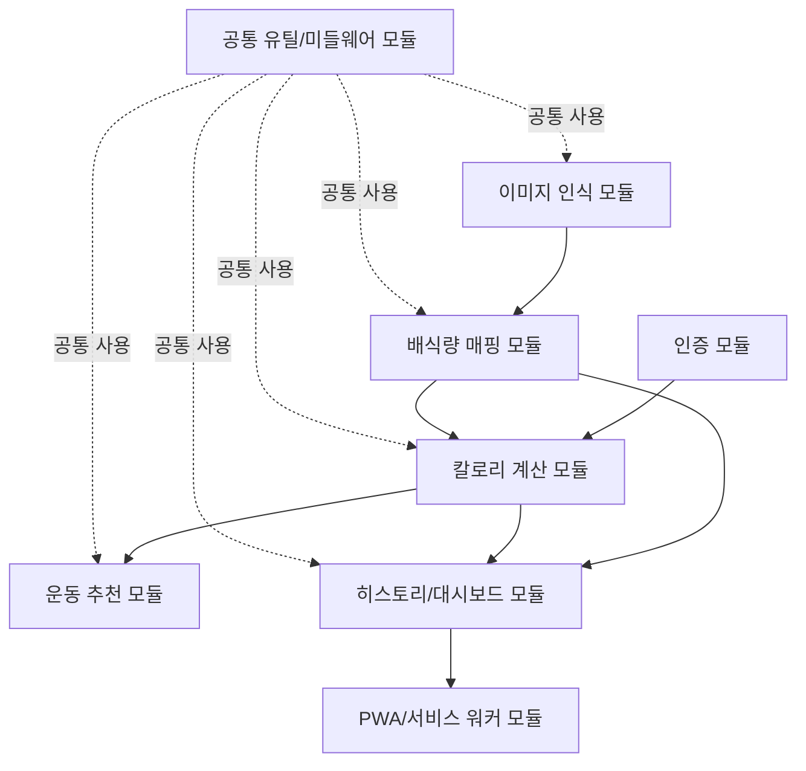

# 시스템 정의서

> Week 4 산출물 (Document Chain #11). 기능명세서.md(#6)를 기반으로 시스템의 기술 스택, 모듈 구성, 인터페이스 규약을 정의한다.

**프로젝트명**: CaloMate (사진 한 장으로 끝내는 15초 칼로리 트래커)
**작성일**: 2026-09-06
**버전**: v1.0
**상태**: 작성 완료

---

## 1. 기술 스택

> V0.43 표준 스택 `Next.js + Tailwind CSS / Express.js / PostgreSQL / Vercel`을 따르되, **현재 마일스톤은 M1~M4(통합 단계)**이므로 백엔드 API는 Express.js 별도 서버가 아닌 **Next.js Route Handlers**로 구현한다. `src/backend/`는 M5+(트래픽 증가 시 분리) 대비 빈 폴더로 유지한다. 상세 정책은 CLAUDE.md "Backend 배치 전략" 및 "Deployment Architecture" 섹션 참조.

| 영역 | 기술 | 버전 | 비고 |
|------|------|------|------|
| Frontend | **Next.js (App Router)** | 14.2.x (LTS 안정 버전) | React 18 기반, Server Component 활용 |
| UI/스타일 | **Tailwind CSS** | 3.4.x | 모바일 우선 반응형 (F-006), PWA 표준 컴포넌트 |
| Backend (M1~M4) | **Next.js Route Handlers** (`src/frontend/app/api/*`) | Next.js 14.2.x 내장 | 표준 스택의 "Express.js"는 M5+ 분리 시 활성화(§3.3 참조) |
| Backend (M5+ 대비, 현재 미사용) | Express.js | 4.19.x (코드 구조만 예약) | `src/backend/`에 `.gitkeep`만 유지, M5 분리 검토 트리거 발생 시 활성화 |
| Database | **PostgreSQL** | 15.x (Supabase 관리형) | Supabase 프로젝트 기본 버전 사용 |
| DB Hosting | Supabase | - | PostgreSQL + REST API(RPC) + Storage(식사 사진) + Auth |
| Deploy | **Vercel** | - | Root Directory: `src/frontend/`, Frontend + API Routes 통합 배포 |
| CI/CD | GitHub Actions | - | `tsc --noEmit`, ESLint, Jest 테스트 파이프라인 |
| 이미지 인식 | LLM Vision API (벤더 미확정, 추상화 계층 경유) | - | NFR-007(벤더 교체 가능 인터페이스), F-001 |
| 인증 | Supabase Auth (또는 NextAuth.js) | Supabase Auth 기본 | 이메일/소셜 로그인, JWT 세션 |
| PWA | next-pwa (Workbox 기반) | 5.6.x | 서비스 워커/매니페스트 생성, F-006 |
| 언어 | TypeScript | 5.4.x | 프론트엔드/API Routes 전 영역 |
| 패키지 매니저 | npm | 10.x | package-lock.json 커밋 |

**한 줄 표기 (현재 단계)**: `Next.js 14.2 (App Router) + Tailwind CSS 3.4 / Next.js API Routes (M1~M4) / PostgreSQL 15 (Supabase) / Vercel`

---

## 2. 모듈 구성

> 기능명세서(#6) F-001~F-006을 지원하는 모듈 단위로 구성한다. 각 모듈은 `src/frontend/app/api/*` 하위의 API 핸들러 그룹과 대응 프론트엔드 컴포넌트로 구현된다.

| 모듈명 | 역할 | 관련 기능 | 의존성 |
|--------|------|-----------|--------|
| 인증 모듈 (Auth) | 회원가입/로그인/세션 관리(Supabase Auth 연동), 사용자 프로필(체중/목표/신체정보) 저장 | F-003 전제조건 | Supabase Auth, PostgreSQL(users 테이블) |
| 이미지 인식 모듈 (Vision Recognition) | 촬영/업로드 이미지를 LLM 비전 API에 전달, 음식명·구성요소·기본 칼로리/매크로 파싱. **벤더 추상화 계층(NFR-007)**을 통해 특정 LLM 벤더에 종속되지 않도록 인터페이스 분리 | F-001 | LLM Vision API(외부), 이미지 압축/전처리 유틸, Supabase Storage(원본 이미지 임시 저장) |
| 배식량 매핑 모듈 (Portion Mapping) | 식약처 외식 영양성분 DB 표준 중량 매핑, "그릇/접시/인분" 단위 ↔ 그램(g) 양방향 변환, 슬라이더 배수 적용 재계산 | F-002 | 이미지 인식 모듈(기본 배식량 단위 수신), 표준 중량 DB(PostgreSQL 참조 테이블) |
| 칼로리 계산 모듈 (Calorie Engine) | BMR/TDEE 산출, 목표 유형별(증량/감량/유지) 일일 권장 칼로리·매크로 계산, 당일 밸런스(잉여/잔여) 산출 | F-003 | 인증 모듈(사용자 프로필), 배식량 매핑 모듈(당일 섭취 칼로리 누적) |
| 운동 추천 모듈 (Exercise Recommender) | 정적 규칙 테이블 기반 운동 추천(MVP), 밸런스·목표 유형에 따른 운동 카드 생성 | F-004 | 칼로리 계산 모듈(당일 밸런스) |
| 히스토리/대시보드 모듈 (History & Dashboard) | 일별/주간별 식사 기록 및 체중 변화 추이 조회, 캘린더·그래프용 시계열 데이터 생성 | F-005 | 배식량 매핑 모듈(저장된 식사 기록), 칼로리 계산 모듈(체중 이력) |
| PWA/서비스 워커 모듈 (Offline & Install) | Web App Manifest 등록, 서비스 워커를 통한 최근 7일 API 응답 캐싱, 오프라인 폴백 렌더링, A2HS 설치 프롬프트 | F-006 | 히스토리/대시보드 모듈(캐시 대상 API), 클라이언트 전용(서버 API 미사용) |
| 공통 유틸/미들웨어 모듈 (Shared) | 에러 핸들링 표준화, 요청 검증(zod 등), 이미지 압축·EXIF 제거(REQ-015), 그램 단위 노출 필터링(REQ-004) | F-001~F-006 전역 | 없음 (최하위 계층) |

### 모듈 의존 관계도



---

## 3. 디렉토리 구조

> **M1~M4 정책(현재 단계)**: API 코드는 전부 `src/frontend/app/api/*`(Next.js Route Handlers, App Router)에 작성한다. `src/backend/`는 `.gitkeep`만 남긴 빈 폴더로 유지하며, M5 분리 검토 트리거(CLAUDE.md 참조: Lambda 60초 초과 작업, 함수 호출 수 한도 초과, 큐/크론 필요 등) 발생 시 동일 구조를 그대로 옮겨 Express.js로 이전한다.

```
src/
├── frontend/                          # Vercel Root Directory
│   ├── app/
│   │   ├── api/                       # M1~M4: 전체 백엔드 API (Route Handlers)
│   │   │   ├── auth/
│   │   │   │   ├── signup/route.ts
│   │   │   │   ├── login/route.ts
│   │   │   │   └── session/route.ts
│   │   │   ├── meals/
│   │   │   │   ├── recognize/route.ts       # F-001: POST 이미지 인식 요청
│   │   │   │   ├── route.ts                 # F-005: GET 일별 기록 조회
│   │   │   │   └── [id]/
│   │   │   │       └── portion/route.ts     # F-002: PATCH 배식량 보정 저장
│   │   │   ├── foods/
│   │   │   │   ├── search/route.ts          # F-001: GET 수동 검색 자동완성
│   │   │   │   └── [id]/
│   │   │   │       └── portion-map/route.ts # F-002: GET 표준 중량 매핑 조회
│   │   │   ├── users/
│   │   │   │   └── goal/route.ts            # F-003: POST 목표 설정 저장
│   │   │   ├── dashboard/
│   │   │   │   └── balance/route.ts         # F-003: GET 일일 밸런스 조회
│   │   │   ├── recommendations/
│   │   │   │   └── exercise/route.ts        # F-004: GET 당일 추천 운동
│   │   │   └── reports/
│   │   │       └── weekly/route.ts          # F-005: GET 주간 요약
│   │   ├── (routes)/                  # 화면 라우트 (화면설계서 #9 기준 확정 예정)
│   │   │   ├── onboarding/
│   │   │   ├── capture/
│   │   │   ├── history/
│   │   │   └── dashboard/
│   │   ├── manifest.ts                # F-006: Web App Manifest
│   │   ├── layout.tsx
│   │   └── globals.css
│   ├── components/
│   │   ├── ui/                        # 공통 컴포넌트(버튼, 카드, 게이지 등)
│   │   ├── meal/                      # 인식 카드, 배식량 슬라이더(F-002)
│   │   ├── dashboard/                 # 칼로리 밸런스 게이지(F-003), 그래프(F-005)
│   │   └── pwa/                       # 설치 배너, 오프라인 안내(F-006)
│   ├── lib/
│   │   ├── vision/                    # LLM 비전 API 벤더 추상화 계층(NFR-007)
│   │   │   ├── VisionProvider.ts      # 인터페이스 정의
│   │   │   └── providers/             # 벤더별 구현체
│   │   ├── portion/                   # 배식량 ↔ 그램 매핑 유틸
│   │   ├── calorie/                   # BMR/TDEE 계산 유틸
│   │   ├── db/                        # Supabase 클라이언트, RPC 래퍼
│   │   └── errors/                    # 공통 에러 클래스/핸들러
│   ├── public/
│   │   ├── icons/                     # PWA 아이콘
│   │   └── sw.js                      # 서비스 워커(next-pwa 빌드 산출물)
│   ├── styles/
│   ├── next.config.js                 # next-pwa 설정 포함
│   ├── tailwind.config.ts
│   └── package.json
└── backend/                            # M5+ 전용, 현재 빈 폴더
    └── .gitkeep                        # M5 분리 시 Express.js 코드로 대체 예정
```

---

## 4. 코딩 컨벤션

| 항목 | 규칙 |
|------|------|
| 언어 | TypeScript 전면 사용 (`.ts`/`.tsx`), `any` 타입 사용 금지(불가피 시 `// eslint-disable` 사유 명시) |
| 네이밍 | 변수/함수: camelCase, 컴포넌트/타입/인터페이스: PascalCase, 상수: UPPER_SNAKE_CASE, 파일명: 컴포넌트는 PascalCase(`MealCard.tsx`), 유틸/라우트는 kebab-case 또는 Next.js 규칙(`route.ts`) 준수 |
| 들여쓰기 | 스페이스 2칸, Prettier 자동 포맷 적용 |
| 린트 | ESLint (`eslint-config-next` 기반) + Prettier, PR 전 `npm run lint` 통과 필수 |
| 컴포넌트 구조 | Server Component 기본, 상태/이벤트 필요 시에만 `"use client"` 명시 |
| API 응답 형식 | 모든 Route Handler는 `{ data, error }` 형태의 일관된 JSON 응답 반환 (§5 에러 처리 규약 참조) |
| 환경변수 | `.env.local`(로컬), Vercel 대시보드(배포). 네이티브 모듈 금지 원칙에 따라 `bcrypt` 대신 `bcryptjs` 사용 |
| 커밋 메시지 | CLAUDE.md Git Conventions 준수: `[주차] 산출물명 - 작업 내용` (예: `[W4] 시스템정의서 - 모듈 구성 작성`) |
| 그램 노출 금지 | F-002(REQ-004) 준수를 위해 화면 렌더링 컴포넌트에서 그램 단위 필드를 직접 출력하는 코드 금지, 공통 포맷터(`formatPortion()`)만 사용 |
| 테스트 | 핵심 계산 로직(칼로리 계산 모듈, 배식량 매핑 모듈)은 단위 테스트 필수, `tests/` 폴더에 Jest 기반 작성 |

---

## 5. 에러 처리 규약

> 기능명세서(#6)의 예외 처리 패턴(API 타임아웃, 인식 실패, 네트워크 단절 등)을 시스템 레벨 표준으로 구체화한다. 모든 API 응답은 공통 유틸/미들웨어 모듈의 에러 핸들러를 통해 아래 형식으로 통일한다.

### 5.1 공통 응답 형식

```json
// 성공
{ "data": { /* ... */ }, "error": null }

// 실패
{ "data": null, "error": { "code": "string", "message": "string", "details": {} } }
```

### 5.2 HTTP 상태 코드 매핑

| HTTP 상태 | 의미 | 응답 예시 (`error.code`) | 발생 시나리오 |
|-----------|------|---------------------------|----------------|
| 400 | Bad Request | `INVALID_INPUT` | 슬라이더 범위(0.5~2.0인분) 초과, 온보딩 목표 미선택, 체중 0 이하 등 유효성 검사 실패 |
| 401 | Unauthorized | `AUTH_REQUIRED` | 세션 만료/미인증 상태에서 인증 필요 API 호출 |
| 404 | Not Found | `RESOURCE_NOT_FOUND` | 존재하지 않는 식사 기록 ID(`meals/{id}`) 조회, 표준 중량 DB에 없는 음식(`portion-map`) |
| 408 | Request Timeout | `RECOGNITION_TIMEOUT` | F-001 LLM 비전 API 응답 3초 초과(NFR-001) — 15초 완결 목표(REQ-005) 보호를 위해 즉시 반환 |
| 422 | Unprocessable Entity | `RECOGNITION_LOW_CONFIDENCE` | 이미지 인식 신뢰도 저하로 대체 후보 3개 반환이 필요한 경우 (실패 아님, 폴백 유도) |
| 500 | Internal Server Error | `INTERNAL_ERROR` | 예기치 못한 서버 오류, LLM 비전 API 벤더사 5xx 응답 |
| 502 | Bad Gateway | `VISION_PROVIDER_ERROR` | LLM 비전 API 벤더 장애 — 벤더 추상화 계층(NFR-007)에서 대체 벤더 폴백 또는 사용자 안내 |
| 503 | Service Unavailable | `OFFLINE_UNAVAILABLE` | 오프라인 상태(F-006)에서 신규 기록(F-001) 시도 시 클라이언트가 반환하는 로컬 에러 |

### 5.3 기능별 예외 처리 표준

| 시나리오 | 관련 기능 | 처리 원칙 |
|----------|-----------|-----------|
| 이미지 인식 실패/저신뢰도 | F-001 | `422 RECOGNITION_LOW_CONFIDENCE` + 대체 후보 3개 리스트를 `data.candidates`에 포함, 클라이언트는 1탭 재지정 UI로 폴백 |
| LLM 비전 API 타임아웃(3초 초과) | F-001 | 클라이언트는 로딩 UI 유지 후 재시도 옵션 제공, 서버는 `408 RECOGNITION_TIMEOUT` 반환하고 15초 초과 방지를 위해 재시도 횟수 제한(최대 1회 자동 재시도) |
| 이미지 업로드 중 네트워크 단절 | F-001 | 클라이언트가 IndexedDB/로컬 스토리지에 임시 저장 후 재전송 안내 배너 노출, 서버 측 별도 처리 없음 |
| 표준 중량 DB 미매칭 음식 | F-002 | `data`에 유사 카테고리 평균값과 `isEstimated: true` 플래그 포함, 500 에러로 처리하지 않음(정상 흐름) |
| 슬라이더 범위 초과 조작 | F-002 | 클라이언트 측 UI 레벨에서 0.5~2.0 범위로 클램핑, 서버는 방어적으로 `400 INVALID_INPUT` 재검증 |
| 온보딩 목표 미선택/비정상 체중값 | F-003 | 클라이언트 유효성 검사로 1차 차단, 서버는 `400 INVALID_INPUT`으로 저장 거부 |
| 식사 기록 없는 날 운동 추천 조회 | F-004 | 에러가 아닌 정상 응답으로 처리: `data: { recommendations: [], reason: "no_meal_data" }` |
| 히스토리 다건 조회 지연 | F-005 | 클라이언트 타임아웃 없음, 서버는 최근 30일 기본 제한 및 페이지네이션(`cursor`) 적용으로 응답 크기 제어 |
| 오프라인 상태 신규 기록 시도 | F-006 | 서버 호출 자체를 발생시키지 않음(클라이언트 서비스 워커가 사전 차단), 카메라/업로드 UI 비활성화 안내 |
| 캐시 만료(7일 초과) 데이터 접근 | F-006 | 서비스 워커가 캐시 타임스탬프 확인 후 "최신 데이터 아님" 배너를 클라이언트에서 노출, 서버 API 관여 없음 |
| 개인정보/민감정보 관련 | F-001 (전역) | 이미지 EXIF 위치정보는 업로드 전 클라이언트에서 제거(REQ-015), 실패 시 업로드 자체를 `400 INVALID_INPUT`으로 차단 |

### 5.4 로깅 및 모니터링 원칙

- 모든 5xx 에러는 서버 로그에 `requestId`, `userId`(마스킹), 발생 모듈명을 기록한다.
- LLM 비전 API 응답 지연/실패율은 벤더 추상화 계층에서 집계하여 향후 벤더 교체 판단 근거로 활용한다(NFR-007).
- 디버깅 시 CLAUDE.md "Deployment Troubleshooting Guide"의 디버그 엔드포인트 배포 원칙을 따른다(Mock 테스트만으로 배포 환경 이슈 검증 불가).

---

**작성 완료 여부**: [x] 기술 스택, 모듈 구성(8종), 디렉토리 구조(M1~M4 정책 반영), 코딩 컨벤션, 에러 처리 규약(HTTP 상태 8종 + 기능별 예외 11건) 작성 완료.
